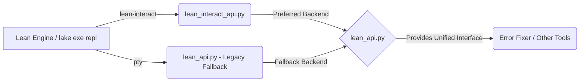
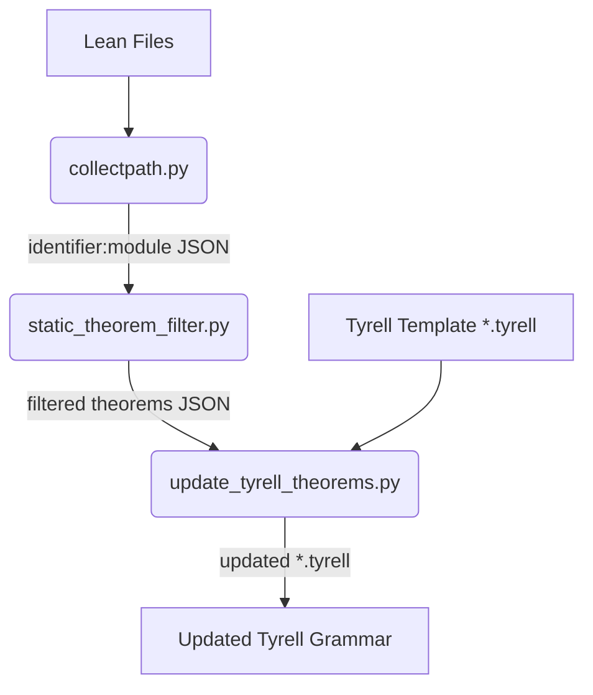
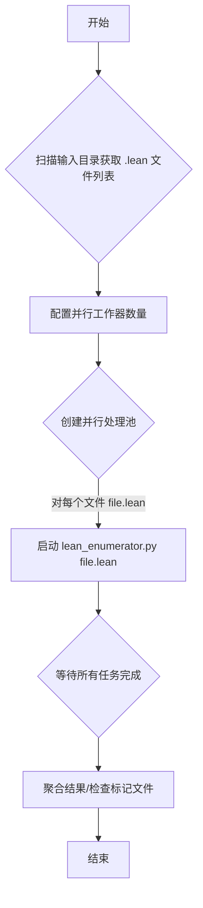
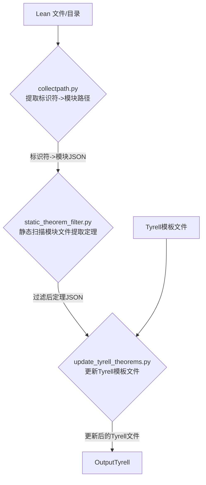

# Lean Enumerator 系统架构

本文档提供了Lean Enumerator系统的详细架构说明，包括系统组件、工作流程、设计理念和关键技术选择。

## 1. 系统概述

Lean Enumerator是一个专为修复Lean数学证明代码错误而设计的自动化工具。它基于程序合成技术，能够分析Lean代码中的错误，并自动生成和应用适当的修复方案。

### 1.1 设计目标

- **自动化**：无需人工干预即可检测和修复常见错误
- **准确性**：提供高质量的修复方案，不引入新的错误
- **可扩展性**：易于添加新的错误类型和修复策略
- **透明性**：提供详细的修复过程信息和统计数据
- **高效性**：支持并行批量处理，提高修复效率
- **可分析性**：提供修复结果的详细统计和可视化

### 1.2 系统组成

系统由以下主要部分组成：

1.  **Lean REPL接口**：
    *   `lean_api.py`: 主要接口，优先使用 `lean-interact` 作为后端。
    *   `lean_interact_api.py`: 基于 `lean-interact` 的独立、稳定实现。
2.  **错误分析器** (`lean_enumerator.py`)：分析和分类错误类型。
3.  **代码预处理器** (`lean_enumerator.py`)：准备用于合成的代码片段。
4.  **程序合成器** (`lean_enumerator.py`)：基于Tyrell框架生成可能的修复方案。
5.  **修复评估器** (`lean_enumerator.py`)：验证生成的修复是否有效。
6.  **修复应用器** (`lean_enumerator.py`)：将成功的修复应用到原始代码。
7.  **批处理系统** (`lean_batch_enumerator.py`)：并行处理多个文件的错误修复。
8.  **日志和分析系统** (`log_analyzer.py`)：记录修复过程、结果和统计指标。
9.  **定理与路径处理工具**：
    *   `collectpath.py`: 收集标识符定义的库模块路径。
    *   `static_theorem_filter.py`: 基于静态分析过滤定理列表。
    *   `update_tyrell_theorems.py`: 更新 Tyrell 语法文件。

## 2. 详细架构

### 2.1 REPL接口层

REPL接口层负责与Lean交互，执行代码并获取错误信息。

- **`lean_api.py`**: 作为主要的接口，它内部会尝试使用 `lean-interact` 库（通过 `lean_interact_api.py` 的逻辑或类似逻辑）来提供更稳定的交互。如果 `lean-interact` 不可用或初始化失败，它会回退到使用传统的 `pty` 方式与 `lake exe repl` 进行交互。
- **`lean_interact_api.py`**: 提供了一个完全基于 `lean-interact` 的 API 实现，通常比 `pty` 方式更可靠。当需要直接使用或确保使用 `lean-interact` 时，可以导入此模块。
- **关键功能**: 封装了代码执行、错误检测、错误位置解析、错误消息提取以及可选的头部声明处理。



### 2.2 错误分析层

错误分析层负责理解和分类Lean产生的错误。主要组件：

- **`extract_error_type`函数**：从错误消息中提取错误类型
- **`similar_error_types`函数**：比较两个错误是否相同（主要基于位置）
- **错误分类系统**：支持多种不同类型的Lean错误

错误类型示例：
- `unknown_constant`: 未知常量错误
- `type_mismatch`: 类型不匹配错误
- `syntax_error`: 语法错误
- `rewrite_failed`: 重写策略失败

### 2.3 代码处理层

代码处理层负责准备和处理代码，为程序合成做准备：

- **`prepare_code_for_synthesis`函数**：提取错误上下文
- **代码分解**：将代码分为错误行前部分、错误行和错误行后部分
- **错误行定位**：精确定位需要修复的代码行

### 2.4 程序合成层

程序合成层是系统的核心，负责生成可能的修复方案：

- **Tyrell框架**：提供程序合成的基础设施
- **`ExhaustiveEnumerator`**：负责枚举可能的修复策略
- **`ToyInterpreter`类**：实现具体修复策略的评估
- **DSL规范**：在`semantic/lean.tyrell`中定义的修复策略语法

修复策略包括：
- 重写策略（如`rw [<- mul_assoc]`）
- 定理应用（如`exact add_zero x`）
- 单行修复（如替换错误的常量名）

### 2.5 评估和验证层

评估和验证层负责检查生成的修复是否解决了原始错误，并且没有引入新的错误：

- **`checker`函数**：测试修复代码片段是否解决了错误
- **`evaluate_fix`函数**：评估完整修复后的代码
- **错误比较逻辑**：比较原始错误和修复后的错误

### 2.6 修复应用层

修复应用层负责将成功的修复方案应用到原始代码：

- **`synthesize_fix`函数**：处理单个错误的修复
- **`synthesize_all_fixes`函数**：批量处理多个错误

### 2.7 批处理系统 (`lean_batch_enumerator.py`)

批处理系统负责并行处理多个Lean文件的错误修复，提高效率：

- **并行执行**：使用Python的`concurrent.futures`模块实现并行处理
- **进度跟踪**：实时显示批处理进度

### 2.8 日志和分析系统 (`log_analyzer.py`)

日志和分析系统负责记录修复过程和结果，并提供统计分析功能：

- **JSON输出**：结构化记录修复结果
- **详细日志**：记录修复过程中的中间步骤
- **统计信息**：计算修复率、成功和失败的错误类型等
- **可视化报告**：生成图表展示修复效果

### 2.9 定理与路径处理工具集

这是一组辅助脚本，用于处理与定理、库路径和Tyrell语法相关的数据：

- **`collectpath.py`**: 从 Lean 文件中提取标识符，并通过 REPL 查询它们定义的库模块路径。支持单个文件和目录处理。
- **`static_theorem_filter.py`**: 读取 `collectpath.py` 生成的 JSON 文件，根据提供的库模块路径，静态扫描对应的 Lean 源文件，使用正则表达式查找 `theorem`/`lemma` 声明，输出筛选后的库和定理列表。
- **`update_tyrell_theorems.py`**: 读取 `static_theorem_filter.py` 或其他来源生成的定理列表 (JSON格式)，并使用该列表更新 Tyrell 语法文件 (`.tyrell`) 中的 `enum Theorem` 部分。支持批量处理 JSON 文件目录。



## 3. 工作流程 (错误修复 - `lean_enumerator.py`)

完整的修复工作流程如下：

```mermaid
flowchart TD
    A[读取Lean代码文件] --> B{解析头部和代码体};
    B --> C[循环: 检测下一个错误];
    C -- 找到错误 --> D[准备合成上下文];
    D --> E[调用Tyrell合成器];
    E -- 生成修复方案 --> F[评估修复方案 (checker/evaluate_fix)];
    F -- 修复有效 --> G[应用修复到代码];
    G --> C;
    F -- 修复无效/无方案 --> C;
    C -- 无更多错误 --> H[保存最终代码和日志];
```

批量处理 (`lean_batch_enumerator.py`) 工作流程：



定理处理与Tyrell更新流程：



## 4. 关键技术

### 4.1 程序合成

系统使用Tyrell程序合成框架，它提供了一种强大的方式来形式化修复策略并自动生成修复方案。关键组件：

- **领域特定语言(DSL)**：用于描述可能的修复方案空间
- **枚举器**：系统地探索可能的修复方案
- **解释器**：评估生成的修复方案

### 4.2 错误分类与匹配

系统使用复杂的错误分类系统来理解Lean错误：

- **模式匹配**：识别错误消息中的关键模式
- **错误比较**：精确比较错误的位置、类型和消息
- **上下文敏感**：考虑错误发生的代码上下文

### 4.3 并行处理

系统利用Python的并行处理功能提高批量修复效率：

- **线程池**：使用`ThreadPoolExecutor`管理并行任务
- **任务分配**：每个文件作为独立任务分配给线程池
- **进度监控**：实时跟踪和显示任务完成情况

### 4.4 日志和分析

系统提供详细的日志和分析功能：

- **结构化日志**：使用JSON格式记录详细信息
- **统计分析**：计算各种修复效果指标
- **可视化**：使用matplotlib生成多种类型的图表展示修复结果

## 5. 可扩展性

系统设计为易于扩展：

### 5.1 添加新的错误类型

要添加新的错误类型识别，只需修改`extract_error_type`函数：

```python
def extract_error_type(error):
    msg = error['message'].lower()
    
    # 已有错误类型...
    
    # 添加新的错误类型
    elif "new error pattern" in msg:
        return "new_error_type"
```

### 5.2 添加新的修复策略

要添加新的修复策略：

1. 在`semantic/lean.tyrell`中添加新的产生式规则
2. 在`ToyInterpreter`类中实现对应的评估方法
3. 测试新策略的有效性

例如，添加一个新的重写策略：

```
# 在Tyrell规范中
enum Direction {
  forward, backward, both
}

# 添加新的产生式规则
func rewrite(Direction, Theorem) -> Command;

# 在ToyInterpreter中实现
def eval_rewrite(self, node, args):
    direction, theorem = args
    if direction == "forward":
        return f"rw [{theorem}]"
    elif direction == "backward":
        return f"rw [<- {theorem}]"
    else:
        return f"rw [{theorem}] {theorem}"
```

## 6. 未来改进方向

1. **机器学习增强**：使用ML技术预测最可能成功的修复策略
2. **依赖分析**：更好地处理跨文件错误和依赖问题
3. **交互式修复**：允许用户选择和定制修复方案
4. **证明策略学习**：从成功的证明中学习常见模式和策略
5. **更丰富的修复策略**：支持更复杂的证明修复

## 7. 总结

Lean Enumerator系统通过结合程序合成、错误分析和Lean REPL交互，提供了一个强大的自动化工具，可以显著提高Lean数学形式化证明的开发效率。其模块化和可扩展的设计使其能够适应各种复杂的错误场景，并且随着时间的推移不断改进和适应新的需求。 